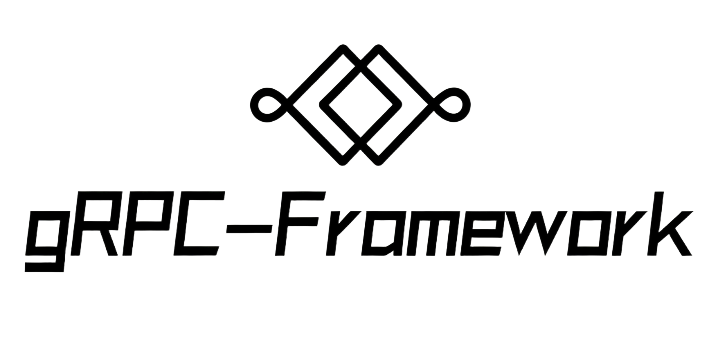

<p align="center">
  
</p>
<p align="center">
    <em>gRPC Framework — a modern gRPC framework with Pythonic APIs</em>
</p>

<p align="center">
Language：
<a href="./README.md" target="_self">🌐 [English](en)</a> | <a href="./docs/README.CN.md" target="_self">🇨🇳 [简体中文](zh)</a> 
</p>

---
**Source Code**: <a href="https://github.com/JokerCrying/grpc-framework" target="_blank">
https://github.com/JokerCrying/grpc-framework
</a>
---

gRPC-Framework is a modern, highly compatible, and more Pythonic gRPC framework for rapidly building gRPC projects and
writing gRPC APIs.

Key Features:

* **Pythonic**: Decorator-driven API design, comprehensive type annotations, multi-paradigm programming, native async
  support, and flexible extension mechanisms. It simplifies complex gRPC service development into elegant, Pythonic
  code, enabling developers to build high-performance gRPC projects in the most natural Python way.
* **Modern**: Embraces modern Python best practices, including native async/await, a complete typing system, domain data
  modeling, contextvars-based context management, and declarative API design via decorators — fully aligned with Python
  3.7+ features and design philosophy.
* **Performance**: Native asynchronous I/O, configurable thread pool executor, efficient middleware chaining, smart
  argument parsing cache, and a grpc.aio-based implementation deliver excellent concurrency and low latency, while
  keeping development convenient.
* **Compatibility/Adaptability**: Seamlessly interoperates with traditional protoc-generated service code via simple
  calls. Supports multiple configuration formats (YAML, JSON, INI, Python module), pluggable serializers and codecs, and
  flexible interceptors and middleware, enabling easy migration and broad tech stack compatibility.
* **Simplicity**: Clean decorator syntax, zero-config defaults, intuitive class-based and function-based views — build
  complete gRPC services with just a few lines of code, making complex distributed communication feel like writing
  regular Python functions.
* **gRPC Standards**: Fully compliant with gRPC standards, supporting all four standard interaction patterns, protobuf
  serialization, service reflection, health checks, interceptors, compression algorithms — ensuring full
  interoperability with any standard gRPC clients and servers.
* **Client Support**: Feature-complete client, including intelligent connection pool management (supports both async and
  sync modes), convenient methods for all four gRPC call patterns, automatic connection maintenance, and warm-up
  mechanisms.

## Dependencies

gRPC Framework is built using the following libraries:

* <a href="https://pypi.org/project/grpcio/" class="external-link" target="_blank">grpcio</a> — standard gRPC
  communication.
* <a href="https://pypi.org/project/grpcio-reflection/" class="external-link" target="_blank">grpcio-reflection</a> —
  standard gRPC reflection.
* <a href="https://pypi.org/project/grpcio-health-checking/" class="external-link" target="_blank">
  grpcio-health-checking</a> — standard gRPC health checking.
* <a href="https://pypi.org/project/protobuf/" class="external-link" target="_blank">protobuf</a> — ProtobufMessage type
  support and parsing.

## Installation

```bash
pip install --upgrade pip
pip install grpc-framework
```

## Configuration

gRPC Framework uses a dedicated configuration class and supports YAML, JSON, INI, and Python modules. You can create it via `GRPCFrameworkConfig.from_module`, `GRPCFrameworkConfig.from_file`, or by instantiating directly.

- package: Required. The package name that hosts the gRPC app. Default `grpc` (using exactly `grpc` is not allowed).
- name: Application name. Default `grpc-framework`.
- version: Application version, recommended format `x.x.x(.beta|alpha)`.
- host: Bind address. Use `[::]` to listen on all addresses.
- port: Service port. Default `50051`.
- serializer: Global serializer that orchestrates the Codec and Converter to process request data.
- codec: Global Codec that converts request bytes to transport objects. Default `ProtobufCodec`.
- converter: Global Converter that converts transport objects to domain models. Default `ProtobufConverter`.
- reflection: Enable gRPC reflection. Default `False`.
- app_service_name: Service name for function-based views under the app. Default `RootService`.
- executor: A Python `Executor` (e.g., `ThreadPoolExecutor` or `ProcessPoolExecutor`). Default `ThreadPoolExecutor(max_workers=os.cpu_count() * 2 - 1)`.
- grpc_handlers: Additional gRPC handlers. Default `None`.
- interceptors: gRPC interceptors. Default `None` (a request parsing interceptor is loaded during service setup).
- grpc_options: gRPC server options. Default `None` (converted to an empty dict during app init).
- maximum_concurrent_rpc: Max concurrent RPCs. Default `None` (unlimited).
- grpc_compression: gRPC compression type. Default `None`.

## Serializer

gRPC Framework provides a serializer that takes two parameters, a codec and a converter. Its main responsibility is
converting request data through the pipeline: request data (HTTP/2 data stream) <> transport object <> domain model.

Some built-in codecs and converters are available from `grpc_framework`:

* **JSONCodec**: Convert bytes into Dict/List
* **ProtobufCodec**: Convert bytes into ProtobufMessage
* **ORJSONCodec**: High-performance JSON codec powered by `orjson` (<span style="color: red;">*</span>requires
  installing `orjson`), leveraging its speed.
* **DataclassesCodec**: Convert bytes into Dict/List
* **ProtobufConverter**: Convert between ProtobufMessage and domain model (binary Protobuf data).
* **JsonProtobufConverter**: Bidirectional conversion between JSON and ProtobufMessage.
* **JsonConverter**: Convert between JSON strings and domain models.
* **DataclassesConverter**: Convert between Dataclass and Dict/List (using JSON bytes).

### Custom Data Conversion

If the data conversion provided by gRPC Framework does not meet your business needs, you can implement your own
serializer.
Implement either `grpc_framework.TransportCodec` or `grpc_framework.ModelConverter`:

#### Codec

* **decode(self, data: BytesLike, into: OptionalT = None) -> Any**: Implement `decode` to convert raw client bytes into
  a transport object.
* **encode(self, obj: Any) -> BytesLike**: Implement `encode` to convert the transport object back to bytes.

```python
class TransportCodec(metaclass=abc.ABCMeta):
    @abc.abstractmethod
    def decode(self, data: BytesLike, into: OptionalT = None) -> Any:
        """bytes -> transport object (e.g., protobuf.Message or dict)"""
        raise NotImplementedError

    @abc.abstractmethod
    def encode(self, obj: Any) -> BytesLike:
        """transport object -> bytes"""
        raise NotImplementedError
```

#### Converter

* **to_model(self, transport_obj: Any, model_type: TypeT) -> T**: Convert the transport object into a domain model.
* **from_model(self, model: T) -> Any**: Convert the domain model back into a transport object.

```python
class ModelConverter(metaclass=abc.ABCMeta):
    @abc.abstractmethod
    def to_model(self, transport_obj: Any, model_type: TypeT) -> T:
        """transport object -> domain model"""
        raise NotImplementedError

    @abc.abstractmethod
    def from_model(self, model: T) -> Any:
        """domain model -> transport object"""
        raise NotImplementedError
```

## Examples

<small><span style="color: red;">*</span>In the examples below, `JSONCodec` and `JSONConverter` are used.</small>

### Create and Run an Application

```python
from grpc_framework import GRPCFrameworkConfig, GRPCFramework

config = GRPCFrameworkConfig.from_module('config')

app = GRPCFramework(config=config)

if __name__ == '__main__':
    app.run()
```

### Function-Based Views

```python
from grpc_framework import GRPCFrameworkConfig, GRPCFramework, Request

config = GRPCFrameworkConfig.from_module('config')

app = GRPCFramework(config=config)


# Approach 1
@app.unary_unary
def IsServerAlive():
    return {"success": True}


# Approach 2
from grpc_framework import Service

some_service = Service("SomeService")


@some_service.unary_unary
def GetSomeData():
    # You can access the current request information
    request = Request.current()
    print(request.metadata)
    return {"success": True, "data": {"id": 1}}


app.add_service(some_service)
```

<details markdown="1">
<summary>Or use <code>async def</code>...</summary>

```python
from grpc_framework import GRPCFrameworkConfig, GRPCFramework, Request

config = GRPCFrameworkConfig.from_module('config')
app = GRPCFramework(config=config)


# Approach 1
@app.unary_unary
async def IsServerAlive():
    return {"success": True}


# Approach 2
from grpc_framework import Service

some_service = Service("SomeService")


@some_service.unary_unary
async def GetSomeData():
    # You can access the current request information
    request = Request.current()
    print(request.metadata)
    return {"success": True, "data": {"id": 1}}


app.add_service(some_service)
```

</details>

### Class-Based Views

```python
from grpc_framework import GRPCFrameworkConfig, GRPCFramework, Service, unary_unary, stream_unary, StreamRequest

config = GRPCFrameworkConfig.from_module('config')
app = GRPCFramework(config=config)


class SomeService(Service):
    @unary_unary
    def GetSomeData(self):
        # You can access the current request information
        print(self.request.metadata)
        return {"success": True}

    @stream_unary
    async def sum_counter(self, data: StreamRequest[dict]):
        result = 0
        async for item in data:
            result += data['count']
        return {'result': result}


app.add_service(SomeService)
```

<details markdown="1">
<summary>Or use <code>async def</code>...</summary>

```python
from grpc_framework import GRPCFrameworkConfig, GRPCFramework, Service, unary_unary, stream_unary, StreamRequest

config = GRPCFrameworkConfig.from_module('config')
app = GRPCFramework(config=config)


class SomeService(Service):
    @unary_unary
    async def GetSomeData(self):
        # You can access the current request information
        print(self.request.metadata)
        return {"success": True}

    @stream_unary
    async def sum_counter(self, data: StreamRequest[dict]):
        result = 0
        async for item in data:
            result += data['count']
        return {'result': result}


app.add_service(SomeService)
```

</details>

## Legacy Compatibility

gRPC Framework provides interfaces to be compatible with legacy projects compiled with protoc, 
allowing them to be seamlessly hosted within gRPC Framework. 
However, request context or middleware configured in the framework will not be available, 
as the legacy service is only hosted rather than fully managed.

### Example

```python
import example_pb2
import example_pb2_grpc


class Greeter(example_pb2_grpc.GreeterServicer):
    def say_hello(self, request):
        return example_pb2.HelloReply(message=f"Hello, {request.name}")

app.load_rpc_stub(Greeter(), example_pb2_grpc.add_GreeterServicer_to_server)
```

## Roadmap

| Status | Feature                       | Planned Version | Notes       |
|--------|-------------------------------|-----------------|-------------|
| ⬜      | Dependency collection         | v1.1.0          | Not started |
| ⬜      | Multi-loop support            | v1.1.0          | Not started |
| ⬜      | Version support               | v1.1.0          | Not started |
| ⬜      | Service-level codec/converter | v1.2.0          | Not started |
| ⬜      | Service-level request context | v1.2.0          | Not started |