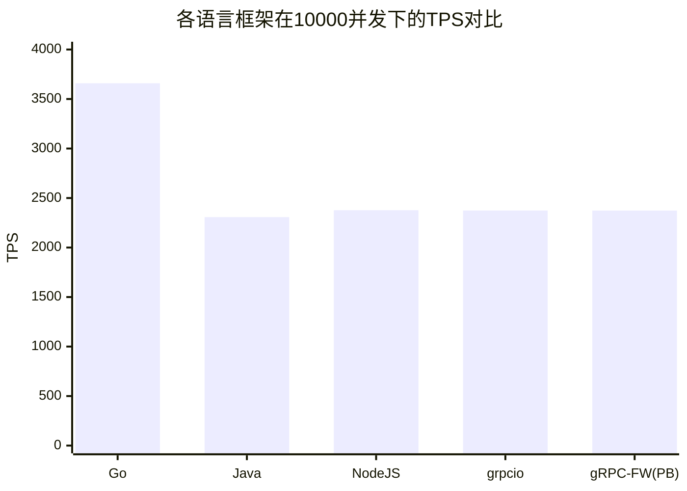
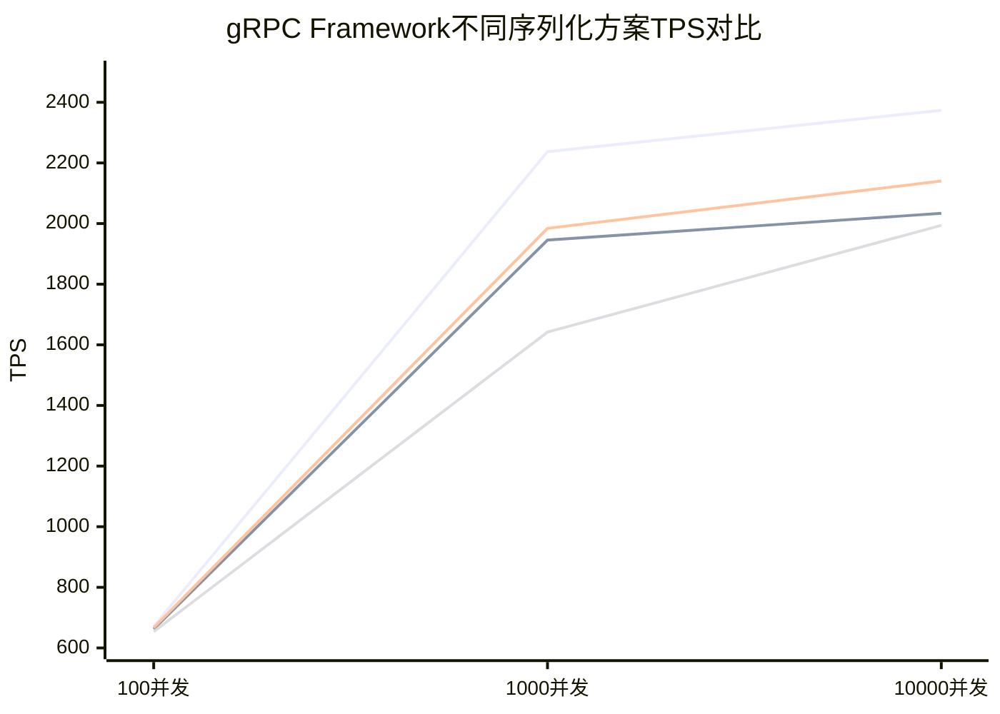
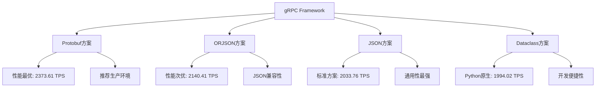

<h1 align="center">
gRPC Framework压力测试报告
</h1>

---

### 测试平台

* **操作环境**: Debian12
* **Python版本**: 3.13.3
* **grpc-framework版本**: 0.1.3b0
* **CPU信息**: 8Core 16Thread x86_64
* **内存信息**: 32G DDR4

---

### 说明

gRPC Framework做了一份详细的压力测试报告，分别测试了多个主流语言的grpc接口的实现、以及grpc-framework的实现，
<em>我们在代码中暂停0.1s来模拟开发中常见的IO操作（如数据库操作、文件操作等）。</em>
我们以100/1000/10000个并发为基准，分别测试了不同的测试平台下的框架性能、错误率、TPS、TPS环比上涨率等多个维度。

* **Go**: 轻量携程。
* **Java**: Netty事件驱动。
* **NodeJS**: libuv拓展。
* **grpcio**: 原生Protobuf + asyncio + uvloop。
* **grpc-framework**: 分别测试原生Protobuf序列化、JSON序列化、ORJSON序列化、Dataclass序列化，以异步编程为主，
  分别测试默认EventLoop和uvloop的测试。

---

#### ProtobufMessage类型

```proto
syntax = "proto3";

package user;

message UserResponse {
  int32 id = 1;
  string name = 2;
}
```

---

### 测试结果

#### Go + 轻量携程

| 请求次数  | 请求总耗时(s) | 错误率(%) | TPS(次/秒) | TPS环比上涨率 |
|-------|----------|--------|----------|----------|
| 100   | 0.115    | 0      | 869.57   | 计算基准     |
| 1000  | 0.254    | 0      | 3937.01  | +352.7%  |
| 10000 | 2.733    | 0      | 3658.98  | −7.1%    |

#### Java + Netty

| 请求次数  | 请求总耗时(s) | 错误率(%) | TPS(次/秒) | TPS环比上涨率 |
|-------|----------|--------|----------|----------|
| 100   | 0.182    | 0      | 549.45   | 计算基准     |
| 1000  | 0.449    | 0      | 2227.17  | +305.4%  |
| 10000 | 4.335    | 0      | 2306.80  | +3.6%    |

#### NodeJS + libuv

| 请求次数  | 请求总耗时(s) | 错误率(%) | TPS(次/秒) | TPS环比上涨率 |
|-------|----------|--------|----------|----------|
| 100   | 0.141    | 0      | 709.22   | 计算基准     |
| 1000  | 0.444    | 0      | 2252.25  | +217.6%  |
| 10000 | 4.207    | 0      | 2376.99  | +5.5%    |

#### grpcio + asyncio + uvloop

| 请求次数  | 请求总耗时(s) | 错误率(%) | TPS(次/秒) | TPS环比上涨率 |
|-------|----------|--------|----------|----------|
| 100   | 0.148    | 0      | 675.68   | 计算基准     |
| 1000  | 0.441    | 0      | 2267.57  | +235.5%  |
| 10000 | 4.212    | 0      | 2374.17  | +4.7%    |

#### grpc-framework + asyncio + Protobuf序列化 + uvloop

| 请求次数  | 请求总耗时(s) | 错误率(%) | TPS(次/秒) | TPS环比上涨率 |
|-------|----------|--------|----------|----------|
| 100   | 0.149    | 0      | 671.14   | 计算基准     |
| 1000  | 0.447    | 0      | 2237.14  | +233.3%  |
| 10000 | 4.213    | 0      | 2373.61  | 6.1      |

#### grpc-framework + asyncio + JSON序列化 + uvloop

| 请求次数  | 请求总耗时(s) | 错误率(%) | TPS(次/秒) | TPS环比上涨率 |
|-------|----------|--------|----------|----------|
| 100   | 0.151    | 0      | 662.25   | 计算基准     |
| 1000  | 0.514    | 0      | 1945.53  | +193.8%  |
| 10000 | 4.917    | 0      | 2033.76  | +4.5%    |

#### grpc-framework + asyncio + ORJSON序列化 + uvloop

| 请求次数  | 请求总耗时(s) | 错误率(%) | TPS(次/秒) | TPS环比上涨率 |
|-------|----------|--------|----------|----------|
| 100   | 0.150    | 0      | 666.67   | 计算基准     |
| 1000  | 0.504    | 0      | 1984.13  | +197.6%  |
| 10000 | 4.672    | 0      | 2140.41  | 	+7.9%   |

#### grpc-framework + asyncio + Dataclass序列化 + uvloop

| 请求次数  | 请求总耗时(s) | 错误率(%) | TPS(次/秒) | TPS环比上涨率 |
|-------|----------|--------|----------|----------|
| 100   | 0.153    | 0      | 653.59   | 计算基准     |
| 1000  | 0.609    | 0      | 1642.04  | +151.3%  |
| 10000 | 5.015    | 0      | 1994.02  | +21.4%   |

---

### 测试结果总结

* 在Protobuf序列化模式下，gRPC Framework的TPS与官方grpcio+asyncio+uvloop组合几乎持平，证明了框架的高效实现。
* 框架提供了Protobuf、JSON、ORJSON、Dataclass等多种序列化方案，满足不同场景需求。
  但不同的序列化导致了不同程度的请求耗时，可通过一些三方库：betterproto、prost、pyrobuf、protobuf3等重写Codec和Converter，实现高效数据传输。
* 在所有测试场景下均保持0%错误率，展现工业级可靠性。

#### 多语言横向对比



图表对比可见：Go语言凭借轻量级协程优势明显，TPS达到3658.98，领先其他语言约54%；
gRPC Framework在Python生态中表现优异，与NodeJS、Java Netty处于同一性能梯队；
Python异步生态日趋成熟，gRPC Framework为Python微服务提供了可靠的高性能解决方案。

#### gRPC Framework各版本TPS分析



图表对比可见：
* **序列化效率差异**: Protobuf最优：二进制序列化，体积小，解析快，在10000并发下TPS达2373.61；ORJSON次之：基于Rust的高性能JSON解析，比标准JSON提升约5.2%；Dataclass相对较低：Python原生序列化在高并发下开销较大。
* **并发 scaling 特性**: 100并发到1000并发环比增长中可见，各版本的实现显著提升（Protobuf最优、Dataclass最差），侧面说明了gRPC Framework下最耗时的即为序列化。
* **高并发下的稳定性**: 1000并发到10000并发过度中，所有版本都保持了正增长或微小下降，这表明框架具有良好的资源管理和并发控制能力。

### 使用场景推荐



对于性能要求极高的生产环境或兼容老grpc项目，建议采用Protobuf序列化；对于需要灵活性的场景，ORJSON提供了良好的性能折衷，当然您也可以自己实现序列化方式。
gRPC Framework的成功证明了Python在高性能网络编程领域的巨大潜力，有能力为Python微服务架构提供强有力的技术支撑。
