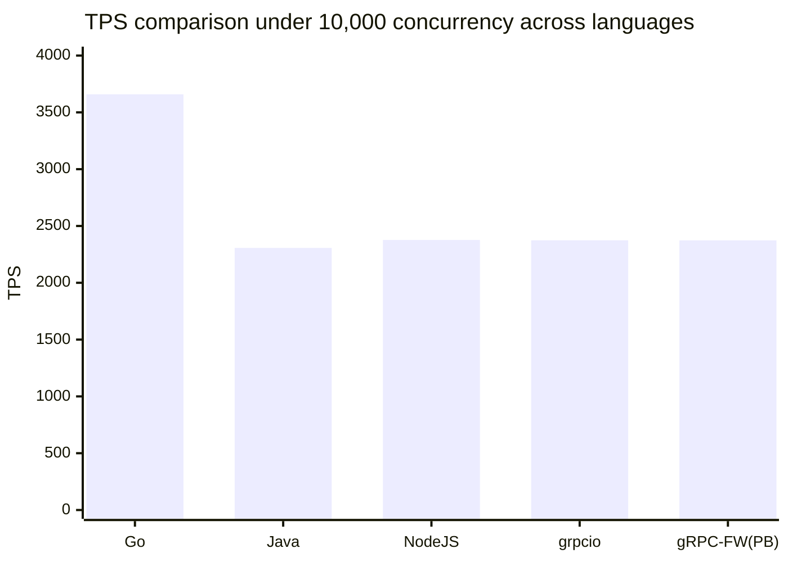
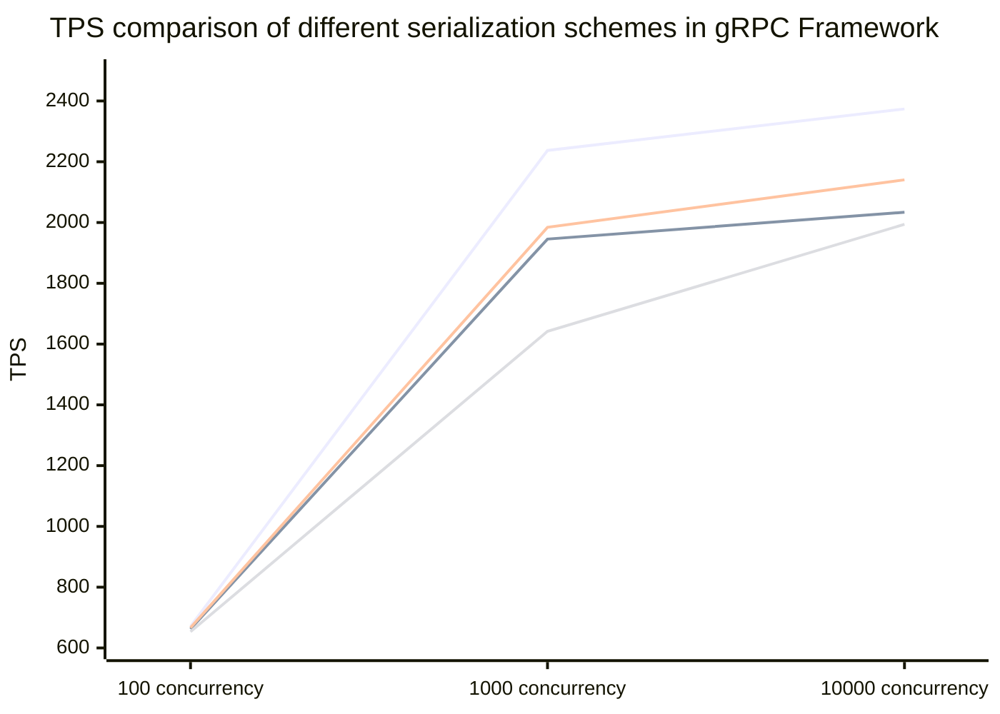
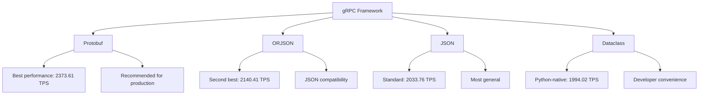

<h1 align="center">
gRPC Framework Performance Test Report
</h1>

---

### Test Environment

* **Operating environment**: Debian 12
* **Python version**: 3.13.3
* **grpc-framework version**: 0.1.3b0
* **CPU**: 8 Core 16 Thread x86_64
* **Memory**: 32G DDR4

---

### Notes

gRPC Framework conducted a detailed performance/pressure test covering multiple mainstream gRPC implementations across languages, as well as this framework itself.
<em>We deliberately pause for 0.1s in the handler to simulate typical I/O operations in real projects (e.g., database queries, file operations).</em>
We benchmark at 100/1000/10000 concurrent requests and evaluate performance across different platforms, including throughput (TPS), error rate, total time, and sequential TPS growth.

* **Go**: Lightweight goroutines.
* **Java**: Netty event-driven.
* **NodeJS**: libuv.
* **grpcio**: Native Protobuf + asyncio + uvloop.
* **grpc-framework**: We test native Protobuf serialization, standard JSON serialization, ORJSON serialization, and Dataclass serialization with an asynchronous approach,
  under both the default event loop and uvloop.

---

#### Protobuf Message

```proto
syntax = "proto3";

package user;

message UserResponse {
  int32 id = 1;
  string name = 2;
}
```

---

### Results

#### Go + Lightweight Goroutines

| Requests | Total Time (s) | Error Rate (%) | TPS (req/s) | Sequential TPS Growth |
|----------|-----------------|----------------|-------------|-----------------------|
| 100      | 0.115           | 0              | 869.57      | Baseline              |
| 1000     | 0.254           | 0              | 3937.01     | +352.7%               |
| 10000    | 2.733           | 0              | 3658.98     | −7.1%                 |

#### Java + Netty (Event-driven)

| Requests | Total Time (s) | Error Rate (%) | TPS (req/s) | Sequential TPS Growth |
|----------|-----------------|----------------|-------------|-----------------------|
| 100      | 0.182           | 0              | 549.45      | Baseline              |
| 1000     | 0.449           | 0              | 2227.17     | +305.4%               |
| 10000    | 4.335           | 0              | 2306.80     | +3.6%                 |

#### NodeJS + libuv

| Requests | Total Time (s) | Error Rate (%) | TPS (req/s) | Sequential TPS Growth |
|----------|-----------------|----------------|-------------|-----------------------|
| 100      | 0.141           | 0              | 709.22      | Baseline              |
| 1000     | 0.444           | 0              | 2252.25     | +217.6%               |
| 10000    | 4.207           | 0              | 2376.99     | +5.5%                 |

#### grpcio + asyncio + uvloop

| Requests | Total Time (s) | Error Rate (%) | TPS (req/s) | Sequential TPS Growth |
|----------|-----------------|----------------|-------------|-----------------------|
| 100      | 0.148           | 0              | 675.68      | Baseline              |
| 1000     | 0.441           | 0              | 2267.57     | +235.5%               |
| 10000    | 4.212           | 0              | 2374.17     | +4.7%                 |

#### grpc-framework + asyncio + Protobuf Serialization + uvloop

| Requests | Total Time (s) | Error Rate (%) | TPS (req/s) | Sequential TPS Growth |
|----------|-----------------|----------------|-------------|-----------------------|
| 100      | 0.149           | 0              | 671.14      | Baseline              |
| 1000     | 0.447           | 0              | 2237.14     | +233.3%               |
| 10000    | 4.213           | 0              | 2373.61     | 6.1                   |

#### grpc-framework + asyncio + JSON Serialization + uvloop

| Requests | Total Time (s) | Error Rate (%) | TPS (req/s) | Sequential TPS Growth |
|----------|-----------------|----------------|-------------|-----------------------|
| 100      | 0.151           | 0              | 662.25      | Baseline              |
| 1000     | 0.514           | 0              | 1945.53     | +193.8%               |
| 10000    | 4.917           | 0              | 2033.76     | +4.5%                 |

#### grpc-framework + asyncio + ORJSON Serialization + uvloop

| Requests | Total Time (s) | Error Rate (%) | TPS (req/s) | Sequential TPS Growth |
|----------|-----------------|----------------|-------------|-----------------------|
| 100      | 0.150           | 0              | 666.67      | Baseline              |
| 1000     | 0.504           | 0              | 1984.13     | +197.6%               |
| 10000    | 4.672           | 0              | 2140.41     | +7.9%                 |

#### grpc-framework + asyncio + Dataclass Serialization + uvloop

| Requests | Total Time (s) | Error Rate (%) | TPS (req/s) | Sequential TPS Growth |
|----------|-----------------|----------------|-------------|-----------------------|
| 100      | 0.153           | 0              | 653.59      | Baseline              |
| 1000     | 0.609           | 0              | 1642.04     | +151.3%               |
| 10000    | 5.015           | 0              | 1994.02     | +21.4%                |

---

### Summary

* Under Protobuf serialization, gRPC Framework's TPS is nearly on par with the official grpcio + asyncio + uvloop stack, demonstrating an efficient implementation.
* The framework provides multiple serialization schemes—Protobuf, JSON, ORJSON, Dataclass—to fit different scenarios.
  Different serializers incur different request times; you can rewrite the Codec and Converter via third-party libraries such as betterproto, prost, pyrobuf, protobuf3 to achieve more efficient data transfer.
* Across all test scenarios the error rate stays at 0%, showing industrial-grade reliability.

#### Cross-language Comparison



The chart shows: Go, with lightweight goroutines, leads clearly with TPS 3658.98, about 54% ahead of others;
gRPC Framework performs strongly in the Python ecosystem, on the same tier as NodeJS and Java Netty;
Python's async ecosystem keeps maturing—gRPC Framework provides a reliable, high-performance solution for Python microservices.

#### TPS Analysis across gRPC Framework Variants



Observations:
* **Serialization efficiency differences**: Protobuf is best—binary serialization yields small payloads and fast parsing, reaching 2373.61 TPS at 10,000 concurrency; ORJSON comes next—Rust-based high-performance JSON parsing, ~5.2% faster than standard JSON; Dataclass is comparatively lower—Python-native serialization has higher overhead under high concurrency.
* **Concurrency scaling**: From 100 to 1000 concurrency we see significant growth across variants (Protobuf best, Dataclass worst), indicating serialization is the dominant cost in gRPC Framework.
* **Stability under high concurrency**: From 1000 to 10000 concurrency all variants maintain positive growth or slight decline, showing good resource management and concurrency control.

### Usage Recommendations



For production scenarios with very high performance requirements or compatibility with legacy gRPC projects, we recommend Protobuf serialization;
for flexibility, ORJSON provides a well-balanced performance trade-off—you can also implement custom serializers.
The success of gRPC Framework demonstrates Python's strong potential in high-performance network programming, offering robust support for Python-based microservice architectures.